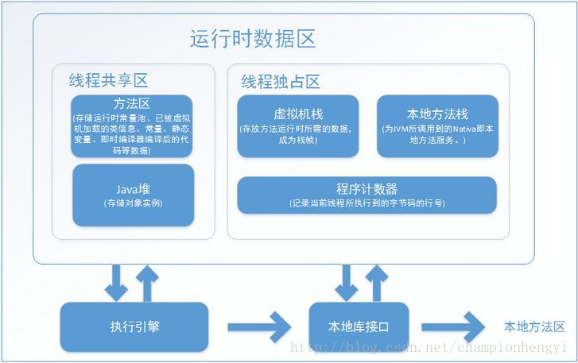

# 1.前言
最近在研究JVM内存模型和Java基础知识。主要讲的是线程共享变量与线程私有变量以及如何写出线程安全的代码。这里列出一条规则，**“类中的成员变量，也叫实例变量，也叫全局变量，它是非线程安全，是所有线程共享的变量，定义在方法中的私有变量是线程安全的，是每个线程私有的”**。那么我们如何通过JVM内存模型来理解这句话。现在汇总知识如下：

# 2. Java虚拟机运行时的数据区


通过上面这幅图片我们可以发现，在JVM虚拟机运行的时候可以将内存区域划分为以上五个部分：方法区、Java堆、JVM虚拟机栈、本地方法栈和程序计数器。其中方法区和堆是线程共享的。虚拟机栈、本地方法栈、程序计数器是线程私有的。

## 2.1 Java虚拟机栈
Java虚拟机栈就是Java方法的内存模型，其中包括局部变量表、操作数栈、动态链接、以及方法的返回地址。

下面我们补充一下Java中的基本数据类型。
> 基本类型(primitive types), 共有8种，即int, short, long, byte, float, double, boolean, char(注意，并没有string的基本类型)。这种类型的定义是通过诸如int a = 3; long b = 255L;的形式来定义的，称为自动变量。值得注意的是，自动变量存的是字面值，不是类的实例，即不是类的引用，这里并没有类的存在。如int a = 3; 这里的a是一个指向int类型的引用，指向3这个字面值。这些字面值的数据，由于大小可知，生存期可知(这些字面值固定定义在某个程序块里面，程序块退出后，字段值就消失了)，出于追求速度的原因，就存在于栈中。

> 最后需要补充的是所有对象的引用也都存在于栈中，而实际的对象本身是存储在堆中的，我们这时候倒可以将引用理解为一个指针，它指向了我们在堆中创建的对象。

下面我们再谈一谈 栈内数据共享：
> 栈中的数据可以共享。假设我们同时定义int a = 3; int b = 3; 编译器先处理int a = 3；首先它会在栈中创建一个变量为a的引用，然后查找有没有字面值为3的地址，没找到，就开辟一个存放3这个字面值的地址，然后将a指向3的地址。接着处理int b = 3；在创建完b的引用变量后，由于在栈中已经有3这个字面值，便将b直接指向3的地址。这样，就出现了a与b同时均指向3的情况。 特别注意的是，这种字面值的引用与类对象的引用不同。假定两个类对象的引用同时指向一个对象，如果一个对象引用变量修改了这个对象的内部状态，那么另一个对象引用变量也即刻反映出这个变化。相反，通过字面值的引用来修改其值，不会导致另一个指向此字面值的引用的值也跟着改变的情况。

有了以上基础知识的储备之后我们再来看一下类中定义在方法中的私有变量是线程安全的，是每个线程私有的这句话。

``` java
public class FunVarShare {

    public void testA(){
        int a;
        Person person=new Person();
    }
}

class Person{
    private String name;
    private int age;
}
```
我们分析这段代码，基本数据类型a和对象person定义在类FunVarShare的testA()方法中。其中a和person引用存在于虚拟机栈帧中的局部变量表中。person引用的对象存在于堆中，是线程共享的。由于虚拟机栈是线程私有的，每个线程调用一次方法都会新创建一个对象，这些对象都属于每个线程所私有，所以虽然对象本身存在于堆中，但也并不共享。至于基本类型由于每个线程执行时将会把局部变量放在各自栈帧的局部变量表中，线程间不共享。所有类中定义在方法中的私有变量是线程安全的，是线程私有的。

## 2.2 Java堆
堆中存储的数据，只要记住一句话，所有new出来的变量都存储在堆中。存在堆中的对象是线程共享的。

``` java
public class ClassVarShare {
    private int a;
}
```
我们分析这段代码，基本数据类型a定义在ClassVarShare类的成员变量中，由于它存放在Java堆中。堆中的对象是线程共享的，所有它是线程不安全的。所有**类中的成员变量，也叫实例变量，也叫全局变量，它是非线程安全，是所有线程共享的变量。**