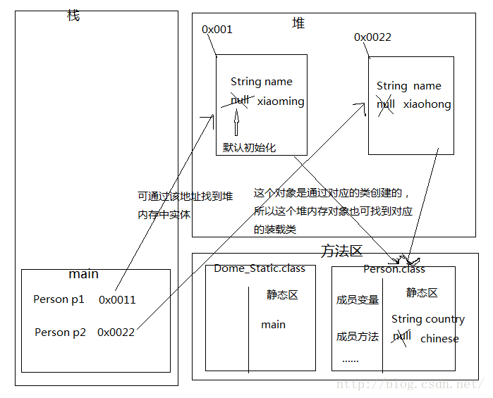

# 1. 前言
 前文中说到了static关键字，在Java中这是一个很重要的关键字，它有很多的用法，并且在某些特定的情况下使用可以优化程序的性能。本文学习static关键字的应用场景。在这之前了解变量的类型，变量按作用域分为成员变量和局部变量，成员变量也就是全局变量，它是在类中声明的，不属于类中任何一个方法。而局部变量是在类中的方法体中声明的，作用域只是这个方法体。

# 2. 详解static关键字
　“static方法就是没有this的方法。在static方法内部不能调用非静态方法，反过来是可以的。而且可以在没有创建任何对象的前提下，仅仅通过类本身来调用static方法。这实际上正是static方法的主要用途。”

**方便在没有创建对象的情况下来进行调用（方法/变量）。**

static关键字可以用来修饰类的成员方法、类的成员变量，另外可以编写static代码块来优化程序性能。

* static关键字修饰的类成员变量在JVM内存模型中，存储在方法区的类成员变量（静态变量）
* static关键字修饰的类成员方法在JVM内存模型中，存储在方法区的方法信息中。一旦类的静态方法被调用，则会在虚拟机栈中创建一个栈帧，然后栈帧被压入虚拟机栈。

如下面一幅图可以理解static关键字修饰的成员变量和成员方法在JVM内存模型中的位置。


# 3. static关键字的用途
static可以用来修饰类的成员方法、类的成员变量，另外可以编写static代码块来优化程序性能。
## 3.1 static方法
static方法一般称作静态方法，由于静态方法不依赖于任何对象就可以进行访问，因此对于静态方法来说，是没有this的，因为它不依附于任何对象，既然都没有对象，就谈不上this了。并且由于这个特性，在静态方法中不能访问类的非静态成员变量和非静态成员方法，因为非静态成员方法/变量都是必须依赖具体的对象才能够被调用。

## 3.2 static变量
static变量也称作静态变量，静态变量和非静态变量的区别是：静态变量被所有的对象所共享，在内存中只有一个副本，它当且仅当在类初次加载时会被初始化。而非静态变量是对象所拥有的，在创建对象的时候被初始化，存在多个副本，各个对象拥有的副本互不影响。

static成员变量的初始化顺序按照定义的顺序进行初始化。

## 3.3 static代码块
static关键字还有一个比较关键的作用就是 用来形成静态代码块以优化程序性能。static块可以置于类中的任何地方，类中可以有多个static块。**在类初次被加载的时候，会按照static块的顺序来执行每个static块，并且只会执行一次**


# 4.常见的面试笔试题目
## 1. 下面这段代码的输出结果是什么？
``` java
public class Test extends Base{
 
    static{
        System.out.println("test static");
    }
     
    public Test(){
        System.out.println("test constructor");
    }
     
    public static void main(String[] args) {
        new Test();
    }
}
 
class Base{
     
    static{
        System.out.println("base static");
    }
     
    public Base(){
        System.out.println("base constructor");
    }
}
```
输出
```
base static
test static
base constructor
test constructor
```

**解析：**
至于为什么是这个结果，我们先不讨论，先来想一下这段代码具体的执行过程，在执行开始，先要寻找到main方法，因为main方法是程序的入口，但是在执行main方法之前，必须先加载Test类，而在加载Test类的时候发现Test类继承自Base类，因此会转去先加载Base类，在加载Base类的时候，发现有static块，便执行了static块。在Base类加载完成之后，便继续加载Test类，然后发现Test类中也有static块，便执行static块。在加载完所需的类之后，便开始执行main方法。在main方法中执行new Test()的时候会先调用父类的构造器，然后再调用自身的构造器。因此，便出现了上面的输出结果。

## 2.这段代码的输出结果是什么？
``` java
public class Test {
    Person person = new Person("Test");
    static{
        System.out.println("test static");
    }
     
    public Test() {
        System.out.println("test constructor");
    }
     
    public static void main(String[] args) {
        new MyClass();
    }
}
 
class Person{
    static{
        System.out.println("person static");
    }
    public Person(String str) {
        System.out.println("person "+str);
    }
}
 
 
class MyClass extends Test {
    Person person = new Person("MyClass");
    static{
        System.out.println("myclass static");
    }
     
    public MyClass() {
        System.out.println("myclass constructor");
    }
}
```

```
test static
myclass static
person static
person Test
test constructor
person MyClass
myclass constructor
```

**解析：**
类似地，我们还是来想一下这段代码的具体执行过程。首先加载Test类，因此会执行Test类中的static块。接着执行new MyClass()，而MyClass类还没有被加载，因此需要加载MyClass类。在加载MyClass类的时候，发现MyClass类继承自Test类，但是由于Test类已经被加载了，所以只需要加载MyClass类，那么就会执行MyClass类的中的static块。在加载完之后，就通过构造器来生成对象。而在生成对象的时候，必须先初始化父类的成员变量，因此会执行Test中的Person person = new Person()，而Person类还没有被加载过，因此会先加载Person类并执行Person类中的static块，接着执行父类的构造器，完成了父类的初始化，然后就来初始化自身了，因此会接着执行MyClass中的Person person = new Person()，最后执行MyClass的构造器。

## 3.这段代码的输出结果是什么？
``` java
public class Test {
     
    static{
        System.out.println("test static 1");
    }
    public static void main(String[] args) {
         
    }
     
    static{
        System.out.println("test static 2");
    }
}
```

```
test static 1
test static 2
```

虽然在main方法中没有任何语句，但是还是会输出，原因上面已经讲述过了。另外，static块可以出现类中的任何地方（只要不是方法内部，记住，任何方法内部都不行），并且执行是按照static块的顺序执行的。

# 4.总结
1. 加载的顺序：父类的static成员变量 -> 子类的static成员变量 -> 父类的成员变量 -> 父类构造 -> 子类成员变量 -> 子类构造

2. static只会加载一次，所以通俗点讲第一次new的时候，所有的static都先会被全部载入(以后再有new都会忽略)，进行默认初始化。在从上往下进行显示初始化。这里静态代码块和静态成员变量没有先后之分，谁在上，谁就先初始化

3. 构造代码块是什么？把所有构造方法中相同的内容抽取出来，定义到构造代码块中，将来在调用构造方法的时候，会去自动调用构造代码块。构造代码快优先于构造方法。

如果类还没有被加载： 
1. 先执行父类的静态代码块和静态变量初始化，并且静态代码块和静态变量的执行顺序只跟代码中出现的顺序有关。 
2. 执行子类的静态代码块和静态变量初始化。 
3. 执行父类的实例变量初始化
4. 执行父类的构造块
5. 执行父类的构造函数 
6. 执行子类的实例变量初始化 
7. 执行子类的构造块
8. 执行子类的构造函数 

如果类已经被加载： 则静态代码块和静态变量就不用重复执行，再创建类对象时，只执行与实例相关的变量初始化和构造方法。

下面列出一个最终版执行顺序：
``` java
public class staticTest {

    public static void main(String[] args) {
        new MyClass();
    }
}

class SuperClass{
    //父类静态构造代码块
    static{
        System.out.println("superClass static block");
    }

    //父类静态变量
    private static SuperStaticVariable staticVariable=new SuperStaticVariable();

    //父类实列变量
    private SuperVariable variable=new SuperVariable();

    //父类构造代码块
    {
        System.out.println("superClass block");
    }

    //父类构造函数
    public SuperClass() {
        System.out.println("SuperClass constructor");
    }
}

class SuperStaticVariable{
    public SuperStaticVariable() {
        System.out.println("SuperStaticVariable init");
    }
}

class SuperVariable{
    public SuperVariable() {
        System.out.println("SuperVariable init");
    }
}

class MyClass extends SuperClass {
    //子类静态变量
    static{
        System.out.println("myclass static");
    }

    //子类静态变量
    private static MyClassStaticVariable staticVariable = new MyClassStaticVariable();

    //子类实列变量
    private MyClassVariable variable = new MyClassVariable();

    //子类构造代码块
    {
        System.out.println("myclass block");
    }

    //子类构造函数
    public MyClass() {
        System.out.println("myclass constructor");
    }
}

class MyClassStaticVariable{
    public MyClassStaticVariable() {
        System.out.println("MyClassStaticVariable init");
    }
}

class MyClassVariable{
    public MyClassVariable() {
        System.out.println("MyClassVariable init");
    }
}
```

执行结果：
```
superClass static block
SuperStaticVariable init
myclass static
MyClassStaticVariable init
SuperVariable init
superClass block
SuperClass constructor
MyClassVariable init
myclass block
myclass constructor
```